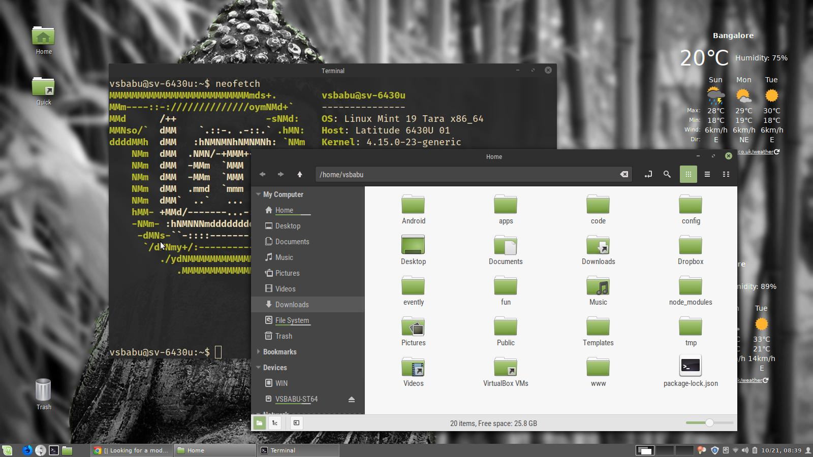

I like regular Mint-X themes; the new Mint-Y and Arc themes have too
much contrast for my eyes.

Basil-X (https://www.gnome-look.org/p/1258665/) is great. It is a spin
off Mint-Y with white backgrounds made less white. 

This one is a copy of Mint-Y-Darker with the same color changes. I am
not well versed in gtk css styles; so just did a search and replace on
what I thought were correct.

All copyright is by original authors.

This is how it looks. I used Mint-X-Darker iconset with this theme.

